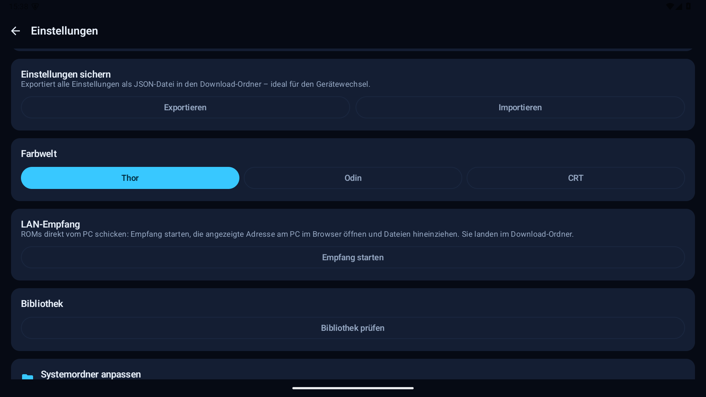

# ⚡ Thor ROM Butler

[](https://github.com/Strugglechen1337/ThorROMButler/actions/workflows/ci.yml)
[](https://github.com/Strugglechen1337/ThorROMButler/releases)
[](#license)
[](#installation)

**Deutsch** | **English**

## Screenshots

| Archive / Archive | Zuordnung / Review | Einstellungen / Settings |
|-------------------|--------------------|--------------------------|
|  |  |  |

## Deutsch

**Der Butler für deine ROM-Sammlung.** Thor ROM Butler erkennt heruntergeladene
ROM-Archive auf deinem Android-Gerät, analysiert sie - ohne sie vollständig zu
entpacken -, bestimmt das Zielsystem und verschiebt sie in den richtigen ROM-Ordner
deiner EmulationStation-DE-Struktur.

Gebaut für Retro-Gaming-Handhelds wie **AYN Thor / Odin** und **Retroid Pocket**,
läuft aber auf jedem Android-Smartphone ab Android 13.

> Kostenlos & Open Source. Distribution über GitHub Releases - nicht im Play Store.

📖 **Neu hier? → [Schritt-für-Schritt-Anleitung](docs/HOWTO.md)**

### Features

- 🔍 **Scanner**: findet ROM-Archive (ZIP, 7z, RAR4) **und lose ROM-Dateien**
  im Download-Ordner und beliebigen weiteren Quellordnern
- 🧠 **Detection Engine**: bestimmt das Zielsystem über Dateiendungen und Magic
  Bytes (inkl. ISO-, RVZ- und CHD-Header) - mit ehrlichen Confidence-Leveln
  (*sicher* / *wahrscheinlich* / *unbekannt*)
- 🧩 **System-Packs & eigene Systeme**: zusätzliche Systeme lokal in den
  Einstellungen anlegen oder als geprüftes JSON-Pack importieren/exportieren.
  Vor dem Import zeigt eine Vorschau Inhalt und Konflikte; Mehrdeutigkeiten
  werden niemals automatisch zugeordnet.
- 🛡️ **Keine Automatik bei Unklarheit**: Nur eindeutig erkannte ROMs bekommen
  einen Zielordner-Vorschlag. Du entscheidest immer selbst - einzeln oder mit
  "Alle übernehmen".
- 📦 **Archiv-Analyse ohne Entpacken**: Inhalte werden direkt im Archiv gelesen;
  `.bin`+`.cue` und `.m3u` werden als Einheit behandelt, BIOS-Dateien erkannt
  und ignoriert
- 🚚 **Einsortieren**: entpackt ROMs mit Fortschrittsbalken, Abbrechen-Option
  und CRC-Prüfung in den richtigen Systemordner - als Foreground-Service, der
  auch ausgeschaltete Displays übersteht. Neue und ersetzte Dateien werden
  transaktional geschrieben: vorhandene ROMs bleiben bis zur erfolgreichen
  Prüfung gesichert. Speicherplatz wird vorab geprüft; Quellarchive bleiben
  standardmäßig erhalten und können optional gelöscht oder nach
  `.thor_trash` verschoben werden.
- 🕹️ **Arcade-Sets bleiben gepackt**: MAME-/Neo-Geo-ZIPs werden als Ganzes
  nach `roms/arcade` bzw. `roms/neogeo` verschoben
- 🗂️ **ES-DE-Ordnerkonvention**: `roms/nes`, `roms/psx`, `roms/dreamcast/<Spiel>/`, ...
- 👁️ **Wächter-Modus** (optional): prüft den Download-Ordner im Hintergrund
  und benachrichtigt bei neuen Funden — einsortiert wird weiterhin nur nach
  deiner Bestätigung
- 🧹 **Bibliotheks-Prüfung**: Statistik pro System, Erkennung falsch
  einsortierter ROMs und Duplikat-Übersicht (Regionen/Revisionen)
- 🏅 **DAT-Verifizierung** (optional): einsortierte ROMs per Prüfsumme
  gegen No-Intro/Redump-DAT-Dateien verifizieren
- 📡 **LAN-Empfang**: ROMs kabellos vom PC-Browser direkt aufs Gerät
  (Einstellungen → „Empfang starten", einmalige Sitzungsadresse am PC öffnen,
  Dateien reinziehen). Uploads werden erst nach vollständigem Schreiben
  sichtbar; die Sitzung endet automatisch nach 30 Minuten. Auch als
  Schnelleinstellungs-Kachel verfügbar: Ein Tipp zeigt die vollständige Adresse,
  bietet Kopieren und kann den Empfang wieder beenden.
- 🔄 **Update-Check & In-App-Download** direkt aus den Einstellungen
- 📜 **Aktions-Log mit Rückgängig**: jede Bewegung wird protokolliert und
  lässt sich direkt aus dem Log zurücknehmen
- 🧩 **Anpassbare Systemordner**: Ordnernamen pro System überschreibbar
  (z. B. `roms/ps1` statt `roms/psx` für Nicht-ES-DE-Frontends)
- 🌍 Deutsch & Englisch · 🌙 **Thor-Design**: Dark Mode only, Neonblau & Gold,
  dezente Glow-Effekte

### Unterstützte Systeme

NES · SNES · Game Boy · Game Boy Color · Game Boy Advance · Nintendo 64 ·
Nintendo DS · Nintendo 3DS · PlayStation 1 · PlayStation 2 · PSP · GameCube ·
Wii · Wii U · Dreamcast · Switch · Amiga · C64 · Mega Drive · Master System ·
Game Gear · Saturn · Sega 32X · Atari 2600 · Atari 7800 · Atari Lynx ·
PC Engine / TurboGrafx-16 · Neo Geo Pocket (Color) · WonderSwan (Color) ·
Arcade (MAME) · Neo Geo

Weitere Systeme lassen sich lokal als eigenes System-Pack ergänzen. Das
[Schema v1](docs/system-pack-schema-v1.md) ist dokumentiert; es gibt keine
automatischen oder ungeprüften Pack-Downloads.

### Unterstützte Archive

| Format | Status |
|--------|--------|
| ZIP    | ✅ Lesen & Analysieren |
| 7z     | ✅ Lesen & Analysieren |
| RAR4   | ✅ Lesen & Analysieren |
| RAR5   | ⚠️ Wird erkannt, aber als "nicht unterstützt" gemeldet |

### Große Archive

Große Archive, auch mehrere Gigabyte, werden beim Einsortieren blockweise
geschrieben und nicht vollständig in den Arbeitsspeicher geladen. Entscheidend
sind freier Speicherplatz im Zielordner und die Kompressionsart.

Für sehr große ROMs ist **ZIP** am zuverlässigsten. **7z/LZMA2** funktioniert,
kann aber je nach Dictionary-Größe viel RAM brauchen. Wenn ein 7z-Archiv trotz
`largeHeap` scheitert, bitte am PC als ZIP oder als 7z mit kleinerem Dictionary
(z. B. 32 MB oder 64 MB) neu packen.

### SD-Karte

Download-Ordner und ROM-Ordner dürfen auf unterschiedlichen Speichern liegen —
z. B. Downloads intern, ES-DE-Struktur auf der SD-Karte. Der Ordner-Picker
zeigt alle Speicherorte an, und beim Einsortieren über Speichergrenzen hinweg
kopiert die App verifiziert und löscht erst danach die Quelle.

### Berechtigungen

Die App benötigt **"Verwaltung aller Dateien"** (`MANAGE_EXTERNAL_STORAGE`).
Das ist eine bewusste Entscheidung: ROM-Archive sind oft mehrere Gigabyte groß,
und die Analyse ohne Entpacken braucht schnellen wahlfreien Zugriff auf die
Archivdateien - das Storage Access Framework ist dafür zu langsam.

Die Netzwerkberechtigung dient dem **Update-Check** gegen die
GitHub-Releases-API und dem ausdrücklich gestarteten **LAN-Empfang** im lokalen
Netz. Der Update-Check erfolgt manuell oder optional (standardmäßig **aus**)
beim App-Start. Der LAN-Server ist nur während einer 30-minütigen Sitzung unter
einer zufälligen Adresse erreichbar. Ab Android 17 fragt die App beim Start
einer solchen Sitzung nach Zugriff auf das lokale Netzwerk; für alle anderen
Funktionen ist diese Freigabe nicht nötig. Es werden keinerlei Nutzungsdaten
gesendet.

### Installation

1. Neueste APK von den [GitHub Releases](../../releases) herunterladen
2. APK installieren ("Unbekannte Quellen" erlauben)
3. Beim ersten Start den Berechtigungs-Dialog bestätigen und ROM-Basisordner wählen

Updates: direkt in der App (Einstellungen → „Auf Updates prüfen") oder über
[Obtainium](https://github.com/ImranR98/Obtainium) — einfach dieses Repo als
Quelle hinzufügen.

Änderungen je Version stehen im [Changelog](CHANGELOG.md).

### Build

Voraussetzungen: JDK 21 und Android SDK (API 37).

```powershell
$env:JAVA_HOME = "D:\Dev\tools\jdk-21"; .\gradlew.bat assembleDebug
```

Die Debug-APK liegt danach unter `app/build/outputs/apk/debug/`.

### Rechtlicher Hinweis

Thor ROM Butler verwaltet nur Dateien, die sich bereits auf deinem Gerät befinden.
Die App enthält keine ROMs und stellt keine Download-Funktionen bereit. Bitte
verwende nur Sicherungskopien von Spielen, die du besitzt.

### Transparenz: KI-Einsatz

Diese App entsteht in enger Zusammenarbeit mit einem KI-Assistenten (Claude):
Architektur, Code und Tests werden gemeinsam entwickelt, jede Version wird vor
dem Release auf echter Hardware getestet. Der gesamte Quellcode ist offen —
Code-Review, Bug-Reports und Feedback sind ausdrücklich willkommen.
Hinweis: Aufgrund ihrer KI-Richtlinie nimmt IzzyOnDroid die App nicht auf;
Installation und automatische Updates laufen stattdessen bequem über
[Obtainium](https://github.com/ImranR98/Obtainium) oder den In-App-Update-Check.

### Optional unterstützen

Thor ROM Butler bleibt kostenlos. Wenn dir die App hilft und du freiwillig Danke
sagen möchtest, kannst du mir gerne einen Kaffee ausgeben:
[paypal.me/marcelstrohmeyer](https://paypal.me/marcelstrohmeyer)

## English

**The butler for your ROM collection.** Thor ROM Butler detects downloaded ROM
archives on your Android device, analyzes them without fully extracting them,
identifies the target system, and moves them into the correct ROM folder in your
EmulationStation-DE structure.

Built for retro gaming handhelds such as **AYN Thor / Odin** and
**Retroid Pocket**, but also works on any Android phone running Android 13 or
newer.

> Free & open source. Distributed through GitHub Releases - not through the Play Store.

📖 **New here? → [Step-by-step guide](docs/HOWTO.md#english)**

### Features

- 🔍 **Scanner**: finds ROM archives (ZIP, 7z, RAR4) **and loose ROM files**
  in the Downloads folder and any number of additional source folders
- 🧠 **Detection engine**: identifies the target system from file extensions and
  magic bytes, including ISO, RVZ, and CHD headers, with honest confidence levels
  (*certain* / *probable* / *unknown*)
- 🧩 **System packs & custom systems**: add systems locally in Settings or
  import/export them as a validated JSON pack. A preview shows contents and
  conflicts before installation; ambiguities are never assigned automatically.
- 🛡️ **No automation when unclear**: only clearly identified ROMs receive a
  suggested target folder. You always decide what gets applied, one item at a
  time or in bulk.
- 📦 **Archive analysis without extraction**: archive entries are read directly;
  `.bin`+`.cue` and `.m3u` files are treated as one unit, while BIOS files are
  detected and ignored
- 🚚 **Sorting**: extracts ROMs into the correct system folder with progress,
  cancellation, and CRC checks. New and replaced files are written as a
  transaction: existing ROMs stay backed up until verification succeeds.
  Storage space is checked beforehand; source archives are kept by default
  and can optionally be deleted or moved to `.thor_trash`.
- 🕹️ **Arcade sets stay packed**: MAME and Neo Geo ZIPs are moved as complete
  sets to `roms/arcade` or `roms/neogeo`
- 🗂️ **ES-DE folder convention**: `roms/nes`, `roms/psx`, `roms/dreamcast/<game>/`, ...
- 👁️ **Watcher mode** (optional): checks the download folder in the
  background and notifies you about new finds — sorting still only happens
  after your confirmation
- 🧹 **Library check**: per-system statistics, detection of misplaced
  ROMs and a duplicate overview (regions/revisions)
- 🏅 **DAT verification** (optional): verify sorted ROMs by checksum
  against No-Intro/Redump DAT files
- 📡 **LAN receive**: send ROMs wirelessly from your PC browser straight to
  the device (Settings → "Start receiving", open the one-time session address,
  drop files). Uploads appear only after the copy completes, and the session
  stops automatically after 30 minutes. Also available as a Quick Settings
  tile: one tap shows the full address, offers copying, and can stop receiving.
- 🔄 **Update check & in-app download** directly from Settings
- 📜 **Action log with undo**: every move is recorded and can be reverted
  right from the log
- 🧩 **Customizable system folders**: override folder names per system
  (e.g. `roms/ps1` instead of `roms/psx` for non-ES-DE frontends)
- 🌍 German & English · 🌙 **Thor design**: dark mode only, neon blue and gold,
  subtle glow effects

### Supported Systems

NES · SNES · Game Boy · Game Boy Color · Game Boy Advance · Nintendo 64 ·
Nintendo DS · Nintendo 3DS · PlayStation 1 · PlayStation 2 · PSP · GameCube ·
Wii · Wii U · Dreamcast · Switch · Amiga · C64 · Mega Drive · Master System ·
Game Gear · Saturn · Sega 32X · Atari 2600 · Atari 7800 · Atari Lynx ·
PC Engine / TurboGrafx-16 · Neo Geo Pocket (Color) · WonderSwan (Color) ·
Arcade (MAME) · Neo Geo

More systems can be added locally through a custom system pack. The
[v1 schema](docs/system-pack-schema-v1.md#english) is documented; packs are
never downloaded or activated automatically.

### Supported Archives

| Format | Status |
|--------|--------|
| ZIP    | ✅ Read & analyze |
| 7z     | ✅ Read & analyze |
| RAR4   | ✅ Read & analyze |
| RAR5   | ⚠️ Detected, but reported as unsupported |

### Large Archives

Large archives, including multi-gigabyte files, are written in chunks while
sorting and are not loaded fully into memory. The important limits are free
space in the target folder and the archive compression method.

For very large ROMs, **ZIP** is the safest option. **7z/LZMA2** works, but can
require a lot of RAM depending on dictionary size. If a 7z archive still fails
despite `largeHeap`, repack it on a PC as ZIP or as 7z with a smaller dictionary
(for example 32 MB or 64 MB).

### SD Card

The download folder and the ROM folder can live on different storages —
e.g. downloads on internal storage, your ES-DE structure on the SD card.
The folder picker shows all storage locations, and cross-storage sorting
uses a verified copy before the source is deleted.

### Permissions

The app requires **Manage all files** (`MANAGE_EXTERNAL_STORAGE`). This is a
deliberate choice: ROM archives are often several gigabytes in size, and
analyzing them without extraction needs fast random access to archive files.
The Storage Access Framework is too slow for this workflow.

Network access is used for the **update check** against the GitHub Releases API
and for the explicitly started **LAN receiver** on the local network. Update
checks are manual or optionally automatic (**off** by default). The LAN server
is reachable only during a 30-minute session at a random address. On Android 17
and newer, the app requests local network access when such a session is started;
the permission is not needed for other features. The app does not send analytics
or user data.

### Installation

1. Download the latest APK from [GitHub Releases](../../releases)
2. Install the APK and allow installation from unknown sources when Android asks
3. On first launch, grant the file permission and choose your ROM base folder

Updates: directly in the app (Settings → "Check for updates") or via
[Obtainium](https://github.com/ImranR98/Obtainium) — just add this repository
as a source.

Version-by-version changes are listed in the [changelog](CHANGELOG.md).

### Build

Requirements: JDK 21 and Android SDK (API 37).

```powershell
$env:JAVA_HOME = "D:\Dev\tools\jdk-21"; .\gradlew.bat assembleDebug
```

The debug APK is generated at `app/build/outputs/apk/debug/`.

### Legal Notice

Thor ROM Butler only manages files that are already present on your device. The
app does not include ROMs and does not provide any download functionality. Please
use only backup copies of games you own.

### Transparency: AI Involvement

This app is built in close collaboration with an AI assistant (Claude):
architecture, code and tests are developed together, and every version is
tested on real hardware before release. The entire source code is open —
code review, bug reports and feedback are very welcome.
Note: due to their AI policy, IzzyOnDroid does not list this app; use
[Obtainium](https://github.com/ImranR98/Obtainium) or the built-in update
check for easy installation and automatic updates instead.

### Optional Support

Thor ROM Butler stays free. If the app helps you and you would like to say
thanks voluntarily, you can buy me a coffee:
[paypal.me/marcelstrohmeyer](https://paypal.me/marcelstrohmeyer)

## License

MIT
