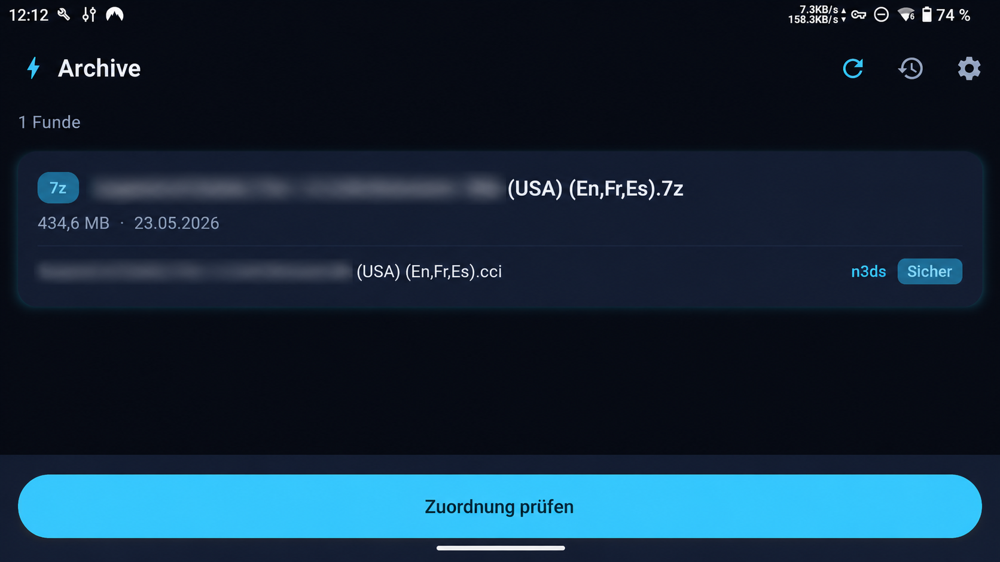
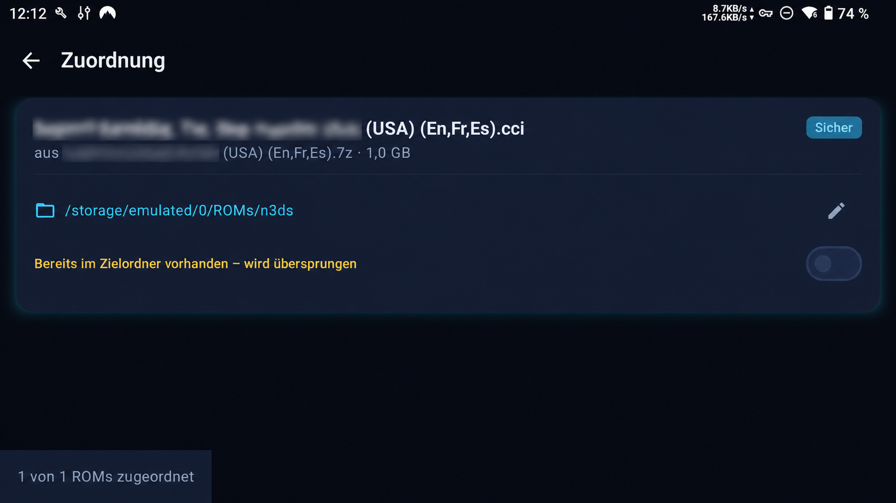

# ⚡ Thor ROM Butler

**Deutsch** | **English**

## Screenshots

| Archive / Archive | Zuordnung / Review | Einstellungen / Settings |
|-------------------|--------------------|--------------------------|
|  |  |  |

## Deutsch

**Der Butler für deine ROM-Sammlung.** Thor ROM Butler erkennt heruntergeladene
ROM-Archive auf deinem Android-Gerät, analysiert sie - ohne sie vollständig zu
entpacken -, bestimmt das Zielsystem und verschiebt sie in den richtigen ROM-Ordner
deiner EmulationStation-DE-Struktur.

Gebaut für Retro-Gaming-Handhelds wie **AYN Thor / Odin** und **Retroid Pocket**,
läuft aber auf jedem Android-Smartphone ab Android 13.

> Kostenlos & Open Source. Distribution über GitHub Releases - nicht im Play Store.

### Features

- 🔍 **Scanner**: findet ROM-Archive (ZIP, 7z, RAR4) **und lose ROM-Dateien**
  im Download-Ordner
- 🧠 **Detection Engine**: bestimmt das Zielsystem über Dateiendungen und Magic
  Bytes (inkl. ISO-, RVZ- und CHD-Header) - mit ehrlichen Confidence-Leveln
  (*sicher* / *wahrscheinlich* / *unbekannt*)
- 🛡️ **Keine Automatik bei Unklarheit**: Nur eindeutig erkannte ROMs bekommen
  einen Zielordner-Vorschlag. Du entscheidest immer selbst - einzeln oder mit
  "Alle übernehmen".
- 📦 **Archiv-Analyse ohne Entpacken**: Inhalte werden direkt im Archiv gelesen;
  `.bin`+`.cue` und `.m3u` werden als Einheit behandelt, BIOS-Dateien erkannt
  und ignoriert
- 🚚 **Einsortieren**: entpackt ROMs mit Fortschrittsbalken, Abbrechen-Option
  und CRC-Prüfung in den richtigen Systemordner - als Foreground-Service, der
  auch ausgeschaltete Displays übersteht. Duplikate werden erkannt (Ersetzen
  nur auf Wunsch), Speicherplatz wird vorab geprüft, vollständig verarbeitete
  Archive werden optional gelöscht.
- 🕹️ **Arcade-Sets bleiben gepackt**: MAME-/Neo-Geo-ZIPs werden als Ganzes
  nach `roms/arcade` bzw. `roms/neogeo` verschoben
- 🗂️ **ES-DE-Ordnerkonvention**: `roms/nes`, `roms/psx`, `roms/dreamcast/<Spiel>/`, ...
- 🔄 **Update-Check & In-App-Download** direkt aus den Einstellungen
- 📜 **Aktions-Log**: jede Bewegung wird protokolliert
- 🌍 Deutsch & Englisch · 🌙 **Thor-Design**: Dark Mode only, Neonblau & Gold,
  dezente Glow-Effekte

### Unterstützte Systeme

NES · SNES · Game Boy · Game Boy Color · Game Boy Advance · Nintendo 64 ·
Nintendo DS · Nintendo 3DS · PlayStation 1 · PlayStation 2 · PSP · GameCube ·
Wii · Wii U · Dreamcast · Switch · Amiga · C64 · Mega Drive · Master System ·
Game Gear · Saturn · Atari 2600 · Arcade (MAME) · Neo Geo

### Unterstützte Archive

| Format | Status |
|--------|--------|
| ZIP    | ✅ Lesen & Analysieren |
| 7z     | ✅ Lesen & Analysieren |
| RAR4   | ✅ Lesen & Analysieren |
| RAR5   | ⚠️ Wird erkannt, aber als "nicht unterstützt" gemeldet |

### Berechtigungen

Die App benötigt **"Verwaltung aller Dateien"** (`MANAGE_EXTERNAL_STORAGE`).
Das ist eine bewusste Entscheidung: ROM-Archive sind oft mehrere Gigabyte groß,
und die Analyse ohne Entpacken braucht schnellen wahlfreien Zugriff auf die
Archivdateien - das Storage Access Framework ist dafür zu langsam.

Internet nutzt die App ausschließlich für den **manuellen Update-Check**
(Einstellungen -> "Auf Updates prüfen", fragt die GitHub-Releases-API ab).
Es werden keinerlei Nutzungsdaten gesendet.

### Installation

1. Neueste APK von den [GitHub Releases](../../releases) herunterladen
2. APK installieren ("Unbekannte Quellen" erlauben)
3. Beim ersten Start den Berechtigungs-Dialog bestätigen und ROM-Basisordner wählen

### Build

Voraussetzungen: JDK 21 und Android SDK (API 37).

```powershell
$env:JAVA_HOME = "D:\Dev\tools\jdk-21"; .\gradlew.bat assembleDebug
```

Die Debug-APK liegt danach unter `app/build/outputs/apk/debug/`.

### Rechtlicher Hinweis

Thor ROM Butler verwaltet nur Dateien, die sich bereits auf deinem Gerät befinden.
Die App enthält keine ROMs und stellt keine Download-Funktionen bereit. Bitte
verwende nur Sicherungskopien von Spielen, die du besitzt.

## English

**The butler for your ROM collection.** Thor ROM Butler detects downloaded ROM
archives on your Android device, analyzes them without fully extracting them,
identifies the target system, and moves them into the correct ROM folder in your
EmulationStation-DE structure.

Built for retro gaming handhelds such as **AYN Thor / Odin** and
**Retroid Pocket**, but also works on any Android phone running Android 13 or
newer.

> Free & open source. Distributed through GitHub Releases - not through the Play Store.

### Features

- 🔍 **Scanner**: finds ROM archives (ZIP, 7z, RAR4) **and loose ROM files**
  in the Downloads folder
- 🧠 **Detection engine**: identifies the target system from file extensions and
  magic bytes, including ISO, RVZ, and CHD headers, with honest confidence levels
  (*certain* / *probable* / *unknown*)
- 🛡️ **No automation when unclear**: only clearly identified ROMs receive a
  suggested target folder. You always decide what gets applied, one item at a
  time or in bulk.
- 📦 **Archive analysis without extraction**: archive entries are read directly;
  `.bin`+`.cue` and `.m3u` files are treated as one unit, while BIOS files are
  detected and ignored
- 🚚 **Sorting**: extracts ROMs into the correct system folder with progress,
  cancellation, and CRC checks. Work runs as a foreground service, duplicate
  files are detected, storage space is checked beforehand, and fully processed
  archives can optionally be deleted.
- 🕹️ **Arcade sets stay packed**: MAME and Neo Geo ZIPs are moved as complete
  sets to `roms/arcade` or `roms/neogeo`
- 🗂️ **ES-DE folder convention**: `roms/nes`, `roms/psx`, `roms/dreamcast/<game>/`, ...
- 🔄 **Update check & in-app download** directly from Settings
- 📜 **Action log**: every move is recorded
- 🌍 German & English · 🌙 **Thor design**: dark mode only, neon blue and gold,
  subtle glow effects

### Supported Systems

NES · SNES · Game Boy · Game Boy Color · Game Boy Advance · Nintendo 64 ·
Nintendo DS · Nintendo 3DS · PlayStation 1 · PlayStation 2 · PSP · GameCube ·
Wii · Wii U · Dreamcast · Switch · Amiga · C64 · Mega Drive · Master System ·
Game Gear · Saturn · Atari 2600 · Arcade (MAME) · Neo Geo

### Supported Archives

| Format | Status |
|--------|--------|
| ZIP    | ✅ Read & analyze |
| 7z     | ✅ Read & analyze |
| RAR4   | ✅ Read & analyze |
| RAR5   | ⚠️ Detected, but reported as unsupported |

### Permissions

The app requires **Manage all files** (`MANAGE_EXTERNAL_STORAGE`). This is a
deliberate choice: ROM archives are often several gigabytes in size, and
analyzing them without extraction needs fast random access to archive files.
The Storage Access Framework is too slow for this workflow.

Internet access is used only for the **manual update check** in Settings. The
app calls the GitHub Releases API and does not send analytics or user data.

### Installation

1. Download the latest APK from [GitHub Releases](../../releases)
2. Install the APK and allow installation from unknown sources when Android asks
3. On first launch, grant the file permission and choose your ROM base folder

### Build

Requirements: JDK 21 and Android SDK (API 37).

```powershell
$env:JAVA_HOME = "D:\Dev\tools\jdk-21"; .\gradlew.bat assembleDebug
```

The debug APK is generated at `app/build/outputs/apk/debug/`.

### Legal Notice

Thor ROM Butler only manages files that are already present on your device. The
app does not include ROMs and does not provide any download functionality. Please
use only backup copies of games you own.

## License

MIT
