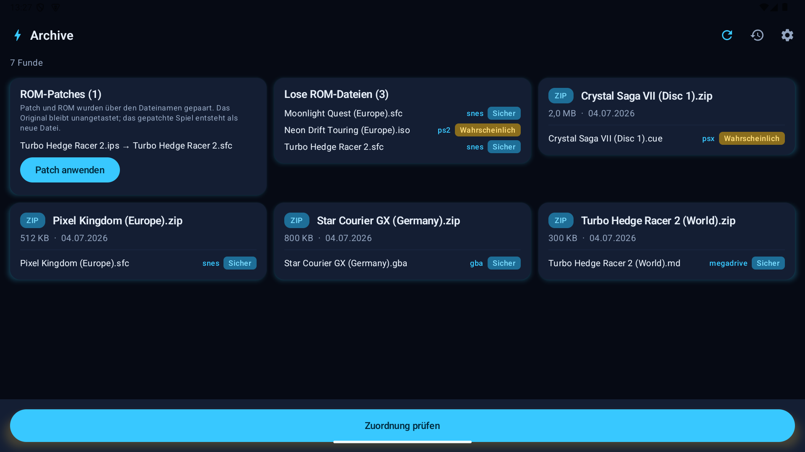
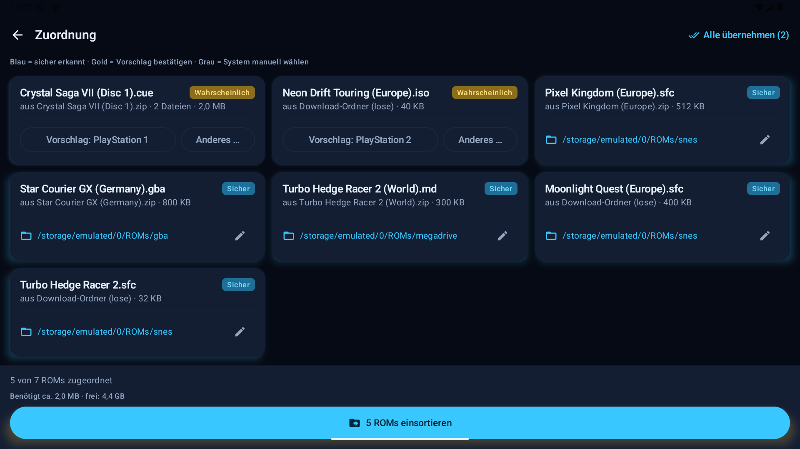
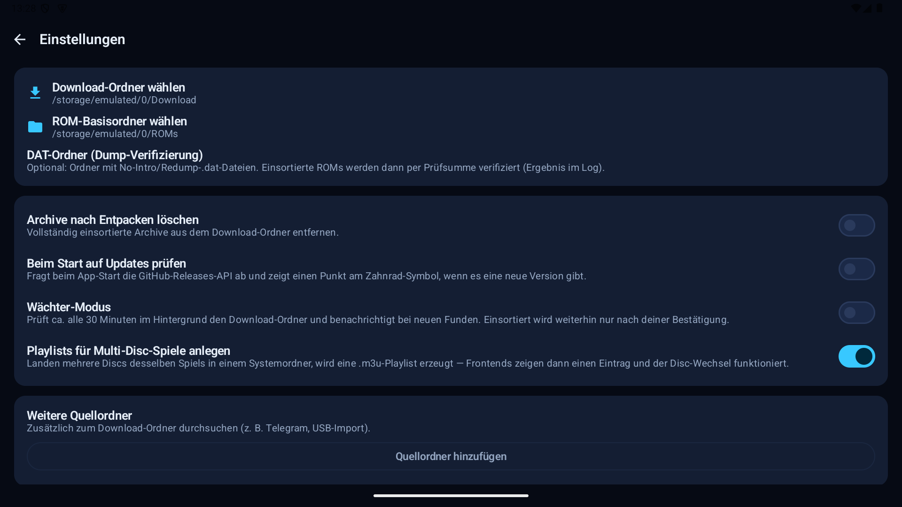

# How to use Thor ROM Butler / Anleitung

**Deutsch** | [English](#english)

## Deutsch

### Was macht die App?

Thor ROM Butler nimmt dir das Einsortieren von ROMs ab: Du legst neue Spiele
(als ZIP/7z/RAR oder lose Datei) in einen Ordner, die App erkennt das
Zielsystem und verschiebt sie in die richtige Ordnerstruktur für
EmulationStation-DE & Co. — z. B. `roms/gba`, `roms/psx`, `roms/dreamcast/…`

**Wichtigstes Prinzip:** Die App verschiebt **nie** etwas ohne deine
Bestätigung. Bei Unsicherheit entscheidest immer du.

### Schritt 1: Installieren & einrichten

1. Neueste APK von den [Releases](../../../releases) laden und installieren
   („Unbekannte Quellen" erlauben)
2. Beim ersten Start führt dich die App durch drei Schritte:
   - **Dateizugriff erlauben** (nötig, um Archive zu lesen und ROMs zu verschieben)
   - **Download-Ordner wählen** — hier landen deine neuen ROMs
     (z. B. `Download/`)
   - **ROM-Basisordner wählen** — der Ordner, der deine System-Unterordner
     enthält (z. B. `ROMs/` mit `gba/`, `psx/`, …). Darf auch auf der
     **SD-Karte** liegen! Fehlende Ordner kann die App selbst anlegen.

### Schritt 2: ROMs aufs Gerät bringen

Egal wie: Browser-Download, vom PC per USB kopiert, Telegram, … — Hauptsache,
die Dateien landen im gewählten Download-Ordner. Gepackt (ZIP, 7z, RAR4) oder
ungepackt, beides funktioniert. Weitere Quellordner kannst du in den
Einstellungen ergänzen.

**Am bequemsten: LAN-Empfang.** In den Einstellungen „Empfang starten",
die einmalige Sitzungsadresse am PC im Browser öffnen (gleiches WLAN) und die
Dateien einfach auf die Seite ziehen — ganz ohne Kabel. Die Warteschlange zeigt
Fortschritt, Tempo und Restzeit. Abgebrochene oder unterbrochene Übertragungen
lassen sich nach erneuter Auswahl derselben Datei fortsetzen; erst vollständig
empfangene Dateien werden sichtbar. Der Empfang endet automatisch nach 30
Minuten. Unter
Android 17 die einmalige Abfrage für den Zugriff auf das lokale Netzwerk
erlauben; sie erscheint erst beim Start des LAN-Empfangs. Noch schneller:
Der LAN-Empfang lässt sich als Schnelleinstellungs-Kachel in die
Statusleiste legen (Statusleiste ausklappen → Stift → „LAN-Empfang"
hinzufügen). Ein Tipp startet den Empfang und zeigt die vollständige Adresse in
einer Sitzungsansicht; dort findest du QR-Code, Teilen, Kopieren und eine
Verbindungsprüfung oder kannst den Empfang beenden. Der kurze Sitzungscode
steht zusätzlich im Kachelnamen. Alternativ kannst du
Dateien aus anderen Apps per
„Teilen → Thor ROM Butler" schicken.

### Schritt 3: Scannen

Die App durchsucht den Ordner und analysiert jeden Fund — bei Archiven
**ohne sie zu entpacken**. Auf jeder Karte siehst du, welche ROMs erkannt
wurden.

### Schritt 4: Zuordnung prüfen

Jedes ROM bekommt eine Einschätzung:

| Farbe | Bedeutung | Was du tun musst |
|-------|-----------|------------------|
| 🔵 **Sicher** | Eindeutig erkannt (Endung/Magic Bytes) | Nichts — Ziel ist vorbelegt |
| 🟡 **Wahrscheinlich** | Starker Hinweis, aber keine Garantie | Vorschlag antippen zum Bestätigen |
| ⚪ **Unbekannt** | Keine sichere Zuordnung möglich | System selbst wählen |

Mit „Alle übernehmen" bestätigst du alle gelben Vorschläge auf einmal.
Duplikate werden erkannt und übersprungen, außer du wählst „Ersetzen". Beim
Ersetzen bleibt die vorhandene Datei gesichert, bis die neue vollständig
geschrieben und geprüft wurde.

### Schritt 5: Einsortieren

Ein Tipp auf **„n ROMs einsortieren"** — die App entpackt bzw. verschiebt
alles in die richtigen Systemordner (mit Fortschrittsbalken, auch bei
ausgeschaltetem Display). Quellarchive bleiben standardmäßig im Download-Ordner;
optional kannst du sie löschen oder für sieben Tage in den Papierkorb verschieben.

Jede Aktion steht im **Log** — inklusive **Rückgängig**, falls du es dir
anders überlegst.

### Gut zu wissen

- **SD-Karte**: Downloads intern, ROMs auf SD? Kein Problem — die App kopiert
  verifiziert über Speichergrenzen hinweg.
- **Wächter-Modus** (Einstellungen): überwacht den Download-Ordner im
  Hintergrund und meldet neue Funde per Benachrichtigung.
- **Arcade/MAME-Sets** bleiben gepackt und werden als Ganzes verschoben.
- **Eigene Ordnernamen** (z. B. `ps1` statt `psx`): Einstellungen →
  „Systemordner anpassen". Für Batocera/Knulli oder Onion OS (Miyoo) gibt
  es fertige **Frontend-Profile**, die alle Ordner in einem Schritt setzen.
- **ROM-Patches (IPS/UPS/BPS)**: Patch-Datei mit demselben Dateinamen wie
  die ROM in den Download-Ordner legen (z. B. `Spiel.sfc` + `Spiel.bps`).
  Der Scan zeigt das Paar als Karte; ein Tipp auf „Patch anwenden" erzeugt
  das gepatchte Spiel als neue Datei — Original und Patch bleiben erhalten.
- **Multi-Disc-Spiele**: Landen mehrere Discs desselben Spiels in einem
  Systemordner, legt der Butler automatisch eine `.m3u`-Playlist an —
  ein Eintrag im Frontend, Disc-Wechsel funktioniert. Abschaltbar in den
  Einstellungen; vorhandene Playlists werden nie überschrieben.
- **Weitere Systeme**: Einstellungen → „System-Packs & eigene Systeme".
  Dort kannst du Definitionen anlegen, bearbeiten und als
  `ThorRomButler-system-pack.json` im Download-Ordner exportieren. Zum Import
  legst du eine solche Datei in den Download-Ordner; der Import ersetzt nur
  deine bisherigen eigenen Systeme. Vor der Bestätigung siehst du Pack-Inhalt
  und Konflikte; Mehrdeutigkeiten bleiben bei der automatischen Zuordnung
  unbekannt.
- **Einstellungen sichern**: Der JSON-Import wird erst vollständig geprüft und
  danach gemeinsam übernommen. Eine fehlerhafte Sicherung ändert nichts.
- **Exakte Duplikate**: Nach der normalen Bibliotheks-Prüfung kannst du optional
  einen SHA-256-Abgleich starten. Nur gleich große Kandidaten werden gelesen;
  gelöscht wird nichts. Pfade und Prüfsummen stehen im Sammlungsexport.
- **Diagnose teilen**: Der Diagnosebericht in den Einstellungen sammelt App-,
  Geräte-, Speicher-, Berechtigungs- und LAN-Status. ROM-Namen und der geheime
  Sitzungscode werden nicht aufgenommen.
- **Gamepad**: D-Pad/Stick navigiert, A bestätigt, B geht zurück —
  Touch funktioniert parallel weiter.
- **Dump-Verifizierung**: Ordner mit No-Intro/Redump-`.dat`-Dateien in den
  Einstellungen wählen — einsortierte ROMs werden per Prüfsumme
  verifiziert (Ergebnis im Log). Optional benennt „Auf DAT-Namen
  umbenennen" verifizierte Einzeldatei-ROMs auf den offiziellen Namen um.
- **Farbwelten**: Thor (blau), Odin (violett) und CRT (grün) in den
  Einstellungen.
- **Updates**: Einstellungen → „Auf Updates prüfen", oder via
  [Obtainium](https://github.com/ImranR98/Obtainium).

---

## English

### What does the app do?

Thor ROM Butler sorts your ROMs for you: drop new games (as ZIP/7z/RAR or
loose files) into a folder, the app detects the target system and moves them
into the right folder structure for EmulationStation-DE & co. — e.g.
`roms/gba`, `roms/psx`, `roms/dreamcast/…`

**Core principle:** the app **never** moves anything without your
confirmation. When in doubt, you decide.

### Step 1: Install & set up

1. Download the latest APK from the [releases](../../../releases) and install
   it (allow unknown sources)
2. On first launch the app walks you through three steps:
   - **Allow file access** (needed to read archives and move ROMs)
   - **Choose the download folder** — where your new ROMs arrive
     (e.g. `Download/`)
   - **Choose the ROM base folder** — the folder containing your per-system
     subfolders (e.g. `ROMs/` with `gba/`, `psx/`, …). It can live on the
     **SD card**! Missing folders can be created by the app.

### Step 2: Get ROMs onto the device

Any way you like: browser download, copied from a PC over USB, Telegram, … —
as long as the files end up in your chosen download folder. Zipped (ZIP, 7z,
RAR4) or loose, both work. Additional source folders can be added in the
settings.

**Most convenient: LAN receive.** Tap "Start receiving" in Settings, open
the one-time session address in a browser on your PC (same Wi-Fi) and simply
drop the files onto the page — no cable at all. The queue shows progress,
speed, and ETA. Cancelled or interrupted transfers resume when the same file is
selected again; files stay hidden until fully received. Receiving stops
automatically after 30 minutes. On Android 17, allow the
one-time local network access prompt; it is shown only when LAN receive is
started. Even quicker: LAN receive is
available as a Quick Settings tile (expand the notification shade → pencil
icon → add "LAN receive"). One tap starts receiving and shows the complete
address in a session view with a QR code, sharing, copying, and a connection
check, or receiving can be stopped there. The short session code also remains
visible in the tile label. Alternatively,
send files from other apps via
"Share → Thor ROM Butler".

### Step 3: Scan

The app scans the folder and analyzes every find — archives are inspected
**without extracting them**. Each card shows which ROMs were detected.

### Step 4: Review

Every ROM gets an honest confidence rating:

| Color | Meaning | What you do |
|-------|---------|-------------|
| 🔵 **Certain** | Unambiguous (extension/magic bytes) | Nothing — target is prefilled |
| 🟡 **Probable** | Strong hint, no guarantee | Tap the suggestion to confirm |
| ⚪ **Unknown** | No reliable match | Pick the system yourself |

"Accept all" confirms every yellow suggestion at once. Duplicates are
detected and skipped unless you opt into replacing them. During replacement,
the existing file stays backed up until the new copy is complete and verified.

### Step 5: Sort

Tap **"Sort in n ROMs"** — the app extracts/moves everything into the right
system folders (with a progress bar, even with the screen off). Source archives
remain in the download folder by default; optionally, they can be deleted or
kept in the trash for seven days.

Every action is recorded in the **log** — including **undo** if you change
your mind.

### Good to know

- **SD card**: downloads on internal storage, ROMs on SD? No problem — the
  app copies with verification across storage boundaries.
- **Watcher mode** (settings): monitors the download folder in the background
  and notifies you about new finds.
- **Arcade/MAME sets** stay zipped and are moved as a whole.
- **Custom folder names** (e.g. `ps1` instead of `psx`): Settings →
  "Customize system folders". For Batocera/Knulli or Onion OS (Miyoo)
  there are ready-made **frontend profiles** that set all folders in one step.
- **ROM patches (IPS/UPS/BPS)**: place a patch file with the same file name
  as the ROM into the download folder (e.g. `Game.sfc` + `Game.bps`). The
  scan shows the pair as a card; tapping "Apply patch" creates the patched
  game as a new file — original and patch stay untouched.
- **Multi-disc games**: when several discs of the same game land in a system
  folder, the butler automatically writes a `.m3u` playlist — one frontend
  entry, working disc swap. Can be disabled in Settings; existing playlists
  are never overwritten.
- **More systems**: Settings → "System packs & custom systems". Create or edit
  definitions there and export them as `ThorRomButler-system-pack.json` in the
  download folder. To import, place that file in the download folder; importing
  replaces only your previous custom systems. Before confirmation, a preview
  shows the pack contents and conflicts; ambiguities remain unknown to
  automatic assignment.
- **Settings backup**: the JSON import is validated completely and then applied
  as one update. An invalid backup changes nothing.
- **Exact duplicates**: after the regular library check, optionally run a
  SHA-256 comparison. Only same-sized candidates are read and nothing is
  deleted. Paths and hashes are included in the collection export.
- **Share diagnostics**: the report in Settings collects app, device, storage,
  permission, and LAN status. ROM names and the protected session code are
  omitted.
- **Gamepad**: D-pad/stick navigates, A confirms, B goes back — touch
  keeps working alongside.
- **Dump verification**: pick a folder with No-Intro/Redump `.dat` files in
  Settings — sorted ROMs are verified by checksum (result in the log).
  Optionally, "Rename to DAT names" renames verified single-file ROMs to
  their official name.
- **Color themes**: Thor (blue), Odin (violet) and CRT (green) in Settings.
- **Updates**: Settings → "Check for updates", or via
  [Obtainium](https://github.com/ImranR98/Obtainium).

